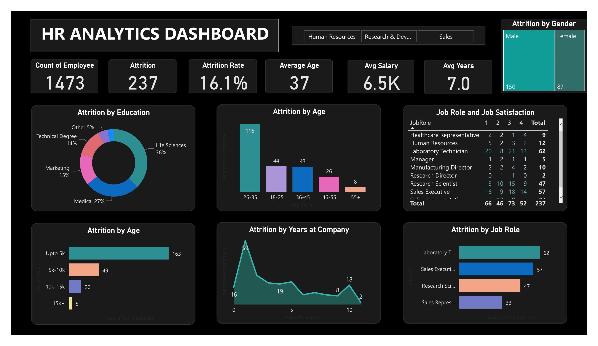

# HR-Analytics

## Introduction

This ia a Power BI project on HR Analytics aimed at analyzing and deriving insights on the factors that impact attrition. The primary objective of the project is to assist the company in determining the necessary actions to take to retain more employees

## Tools

* Power Query Editor
* Power BI

## Project Workflow

* The data is cleaned and transformed using Power Query. 
* Dashboard is created with visualizations like pie chart, area chart and bar charts.
* Insights

## Data Visualization

